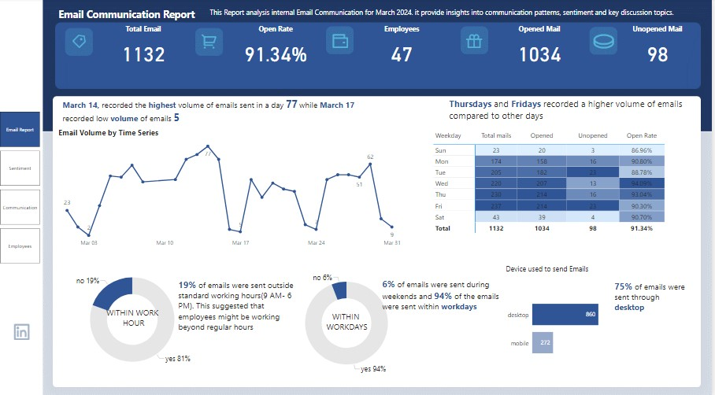
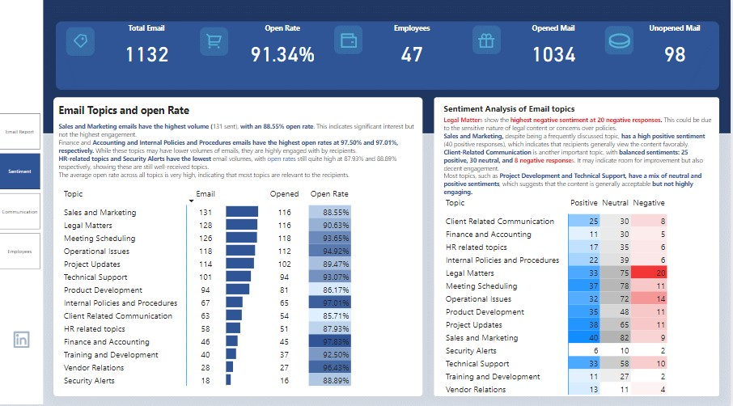
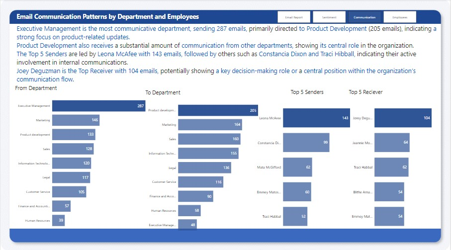
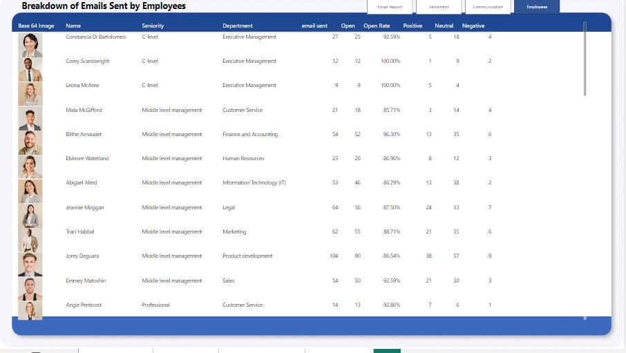

# Email Analysis Report 

### **1. Introduction**

This report analyzes the email communication patterns in a company using the dataset provided. The dataset includes details about emails sent and received, such as the sender's and recipient's departments, seniority levels, the topic of emails, the device used to access the emails, whether the emails were opened or not, and their sentiment.

The main goal of this analysis is to provide insights into:
- Email communication patterns across departments and seniority levels.
- Employee engagement metrics (open rate, device usage).
- Sentiment analysis of emails (positive, neutral, negative).
- Email activity during work hours and workdays.

### **2. Dataset Overview**

The dataset consists of three main sheets:

1. **emails - fact table**: Contains information about individual emails.
2. **contacts - dimension table**: Provides details about contacts involved in the communication.
3. **dictionary**: Contains descriptions of the dataset fields.

#### **2.1 Key Columns from the "emails - fact table"**:

| Column Name          | Description                                                         |
|----------------------|---------------------------------------------------------------------|
| Email id             | Unique identifier for each email                                    |
| From Name            | Name of the person who sent the email                               |
| From seniority       | The seniority level of the sender (C-level, Middle, etc.)            |
| From Department      | The department of the sender                                        |
| To Name              | Name of the person who received the email                           |
| To seniority         | The seniority level of the recipient                                |
| To Department        | The department of the recipient                                     |
| Email topic          | The topic of the email                                              |
| Date                 | The date the email was sent                                         |
| Sentiment            | The sentiment of the email (positive, neutral, negative)            |
| Is opened?           | Whether the email was opened or not (opened, unopened)              |
| Device               | The device used to send or receive the email (desktop, mobile)      |
| Within work hours    | Indicates if the email was sent during work hours (yes/no)          |
| Within workdays      | Indicates if the email was sent during workdays (yes/no)            |

---

### **3. Data Transformation**

For the purpose of this analysis, some transformations were applied to the dataset:
1. **Date Format**: Dates were parsed correctly to ensure proper sorting and aggregation by date.
2. **Text Categories**: Columns such as `Sentiment`, `Device`, and `Is opened?` were categorized for easier aggregation.
3. **Calculated Columns**: New calculated columns were created to analyze email communication patterns (e.g., open rate, sentiment distribution).

### *4. Insights**

1. **Email Volume & Timing:**
   - A total of 1,132 emails were sent in March 2024, with an open rate of 91.34%.
   - March 14th recorded the highest volume of emails (77), while March 17th had the lowest (5).
   - 19% of emails were sent outside of standard working hours (9 AM - 6 PM), and 6% were sent during weekends.

2. **Device Usage:**
   - 75% of emails were sent through desktops, indicating a preference or reliance on desktop devices for email communication within the organization.

3. **Department Communication:**
   - **Executive Management** is the most communicative department, sending 287 emails, primarily to Product Development (205 emails).
   - **Product Development** also receives substantial communication from other departments, indicating its central role in the organization.
   - The **Top 5 Senders** include Leona McAfee (143 emails) and Constancia Dixon (99 emails), showing active involvement in internal communications.

4. **Employee Breakdown:**
   - **Constancia Di Bartolomeo** from Executive Management sent 27 emails with an open rate of 92.59%, with a sentiment skewed towards negative (18 out of 27).
   - **Leona McAfee** has an open rate of 100% for the 9 emails sent, with sentiments balanced between positive and neutral.
   - **Joey Deguzman** from Product Development is the top receiver with 104 emails, showing his central role within the communication flow.

### **Recommendations:**

1. **Email Management:**
   - Since 19% of emails are sent outside standard working hours and 6% on weekends, consider implementing guidelines to manage after-hours communication to ensure a work-life balance.
   - Explore why a significant portion of emails have a negative sentiment, particularly for key senders like Constancia Di Bartolomeo, and address any underlying issues.

2. **Device Optimization:**
   - Since 75% of emails are sent via desktops, ensure that the desktop email platform is optimized for efficiency. Consider investigating if mobile usage could be improved for better flexibility, especially for employees working outside the office.

3. **Targeted Training:**
   - Given that Executive Management and Product Development departments are key in communication, provide targeted training to improve their email effectiveness, particularly focusing on how to convey messages with a more positive sentiment.

4. **Employee Engagement:**
   - Conduct workshops or training to help employees craft more positive and engaging emails, especially for those like Constancia Di Bartolomeo and Elinore Westland, who have a higher frequency of negative emails.

5. **Monitor Open Rates:**
   - Maintain the high open rate but also ensure that the content of the emails leads to productive outcomes. High open rates with negative sentiment may indicate that the emails are being opened but not leading to positive engagement.

By focusing on these areas, the organization can improve its internal communication, enhance employee engagement, and foster a more positive work environment.

---

### **6. Tools Used**

- **Power BI**: For data visualization and reporting.
- **DAX**: For calculating custom metrics.
- **Excel**: For initial data preparation.

### **7. visualization**

